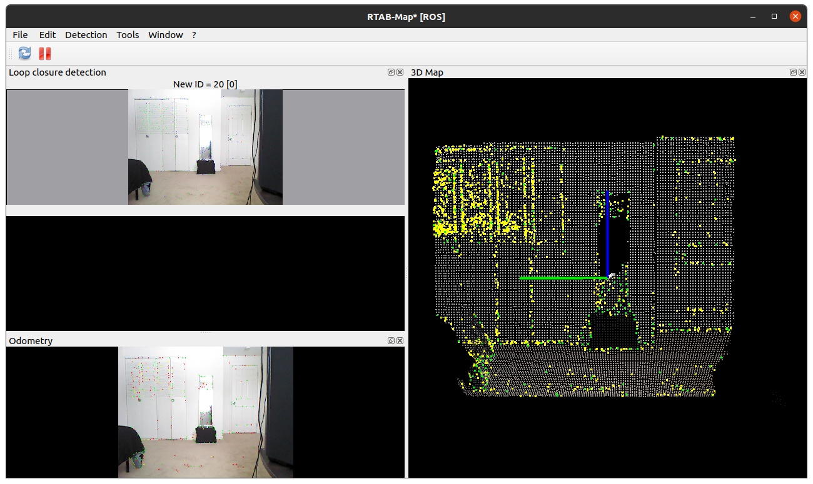

# rtabmap_ros [ [Github](https://github.com/introlab/rtabmap_ros) | [Wiki](http://wiki.ros.org/rtabmap_ros) ]

ROS wrapper of [RTAB-MAP](http://introlab.github.io/rtabmap/) (Real Time Appearance-Based Mapping).

## Installation

### Ubuntu

```zsh
sudo apt install ros-noetic-rtabmap-ros
```

## Testing with Microsoft Kinect

1. Setup the environment for kinect using [this](kinect.md) guide.
2. Run the freenect node,
   ```zsh 
   roslaunch freenect_launch freenect.launch depth_registration:=true
   ```
   > Remember to source the workspace before launching the node. `source ~/catkin_ws/devel/setup.zsh`
3. Run the rtabmap_ros node in mapping mode,
   ```zsh
   roslaunch rtabmap_ros rtabmap.launch rtabmap_args:="--delete_db_on_start"
   ```
   
   > `--delete_db_on_start` argument is used to reset the map before starting.


## Useful Resources

- https://github.com/introlab/rtabmap/wiki/Kinect-mapping