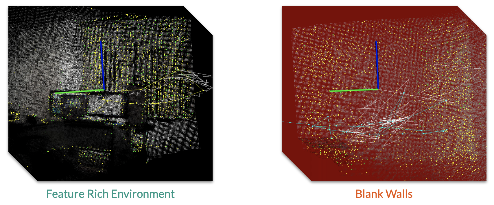

# Milestone 2

This milestone involved moving the RGBD SLAM system to the Pioneer 3 robot platform with a Kinect camera mounted on it. 

## Robot System Setup

The setup used for testing handheld mapping using RTAB-MAP and Kinect was replicated on the robot driver laptop and preliminary tests were performed by manually pushing the robot around.

## Incorporating Robot Odometry

Using visual odometry fails in situations where there are less distinct features that can be tracked between frames. 

To tackle this issue, the wheel odometry data obtained from the robot using `p2os` was incorporated in RTAB-MAP.

## Robot control using an Xbox controller

The initial tests/runs were performed by pushing around the robot, a major issue with this was wheel slippage that caused unnecessary errors in the odometry. To avoid such errors an Xbox controller was added to the setup so it could be controlled by providing commands through `p2os`. 

## Recording Rosbags

For consistent data while tuning SLAM parameters, rosbags for multiple runs throughout the 3rd floor of Golissano were recorded. These were replayed and used to tune the parameters without the need to have the robot connected.

## Current Issues

- Drift accumulated in the wheel odometry.
- Loop closure issues.
